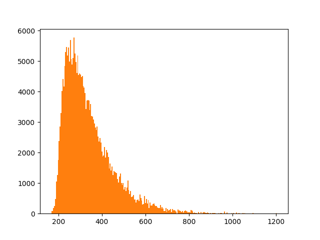

# EMCCD Simulator

## Introduction

The library is used to simulate both the serial register and readout noise of an EMCCD.  The simulation of the serial register includes both the multiplicative mechanism and also clock induced charge.  The output part of the add bias and Gaussian noise. Large number of frames/pixels may be simulated through the register, as it is implemented using Apache Spark


## License

The code is licensed under the Apache 2.0 license. See license file for details

## Installing

This requires python 3.6 +

```shell script
git clone https://github.com/fatmac78/emccd_simulator.git
cd emccd_simulator
pip install -r requirements.txt
```

## Usage

An example of the using of the library to simulate an stack going of input images going through the EMCCD may be found here:

```python
from electron_multiplier import ElectronMultiplier
import numpy as np
from pyspark import SparkContext, SparkConf
from matplotlib import pyplot as plt

# EMCCD parameters
em_stages = 200
em_gain = 100
prob_cic = 0.01  
readout_mu = 200
readout_sigma = 15
random_seed = 1234

# Generate a test input image stack of 100 50x50 frames, 1 photon in each (250k input photons)
input_image_stack=np.full((100, 50, 50), 1)   

conf = (SparkConf()) # Configure your Spark environment here as nessessary
sc = SparkContext(conf=conf)

emccd=ElectronMultiplier(em_stages, em_gain, prob_cic, random_seed, 
                             readout_mu, readout_sigma, sc)

output_pixels = emccd.simulate_stack_spark(input_image_stack)

```

The output histogram produced by this may be visualised, where the multiplicative gain, bias and readout noise may be seen

```python
plt.hist(output_pixels, bins='auto')
plt.show()
```



The above simulation method `simulate_stack_spark` flattens the data in order to speed up the simulation, returning flattened output pixel data.  If the format is output frames is required, a slower non-parallelized `image_shift_out` method may be used that simulates individual frames passing through the EMCCD 

